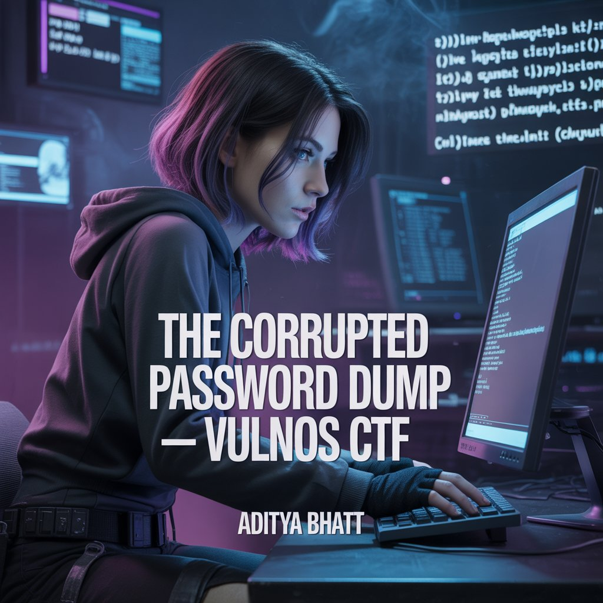
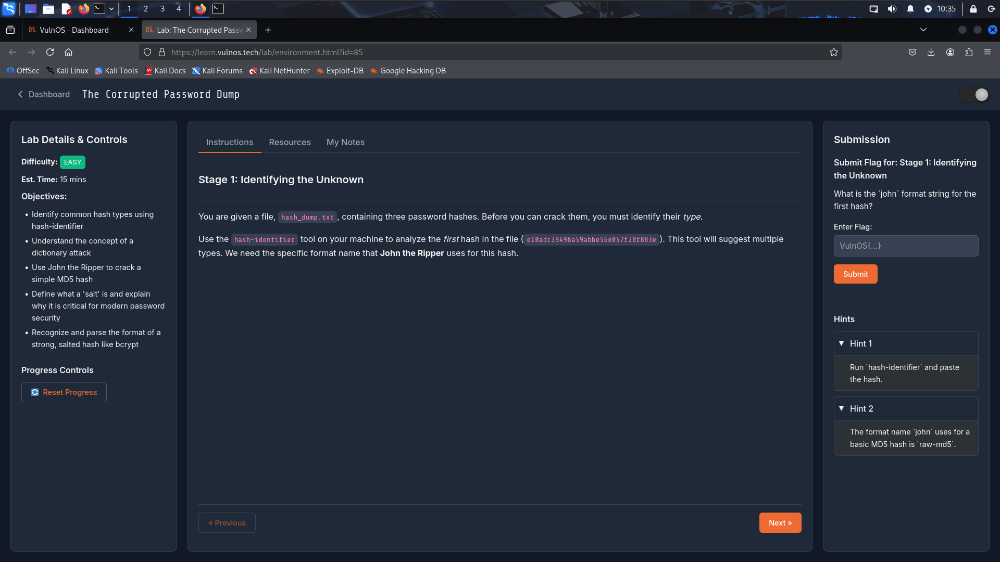
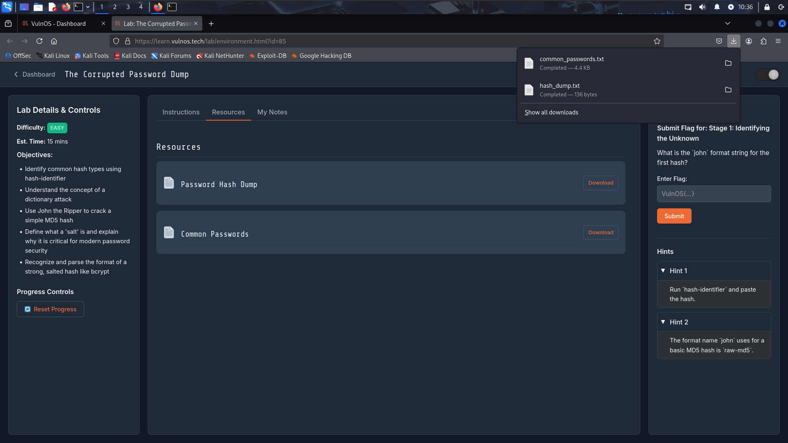
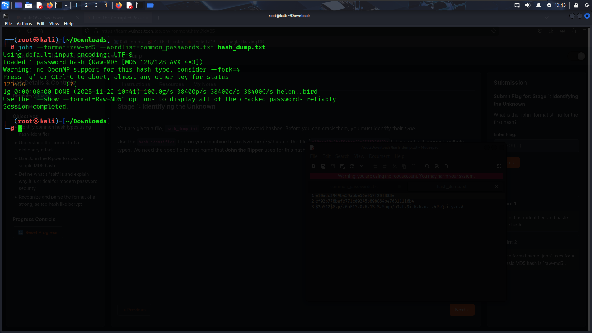
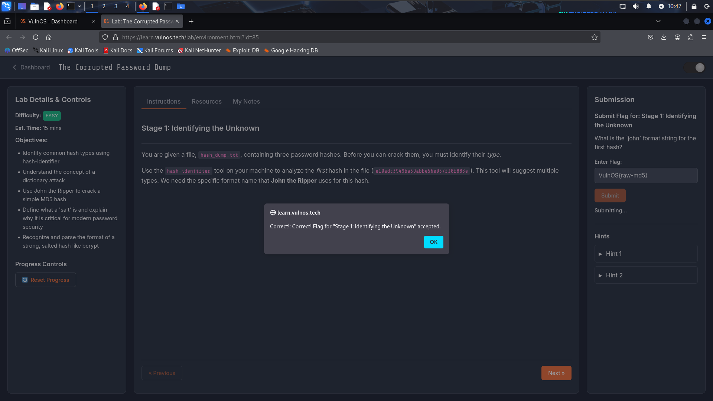
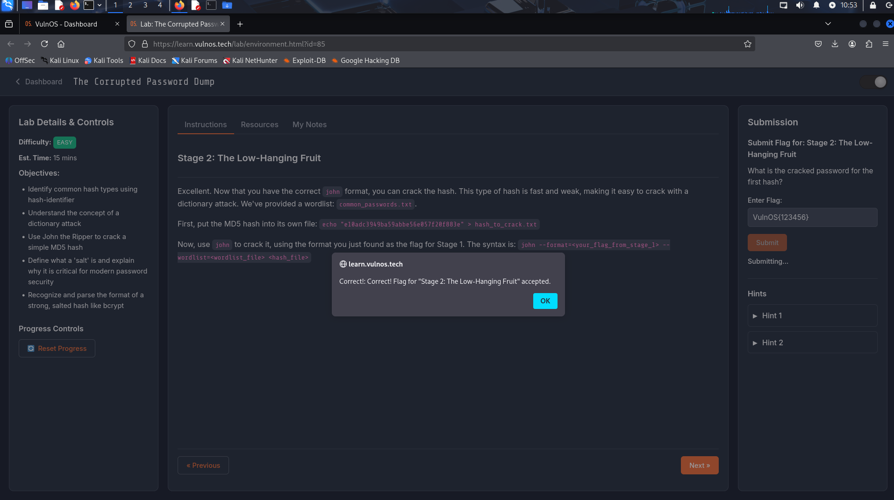

# 🔐 The Corrupted Password Dump — A Gentle Walk Through Hash Chaos 🗿🔥

**VulnOS Lab 85** <br/>
**Lab Link:** [https://learn.vulnos.tech/lab/environment.html?id=85](https://learn.vulnos.tech/lab/environment.html?id=85) <br/>
**Difficulty:** Easy <br/>
**Est. Time:** 15 mins <br/>

---

## 🌟 Overview

This lab gives us three password hashes, a small dictionary, and the task to identify hash formats, perform a dictionary attack using JtR, and extract the salt from a bcrypt hash.
A quick and clean dive into essential password-security fundamentals 🔥

 <br/>

---

# 🧪 PoC — Step-by-Step Breakdown (Mapped to Screenshots)

Below is the **full proof-of-concept** matching each step with its corresponding screenshot inside the `Corrupted_Passwd_Dump` directory.

---

# **1. Lab Instructions & Hints**

We start by reviewing the lab objectives:
– Identify hash types
– Perform a dictionary attack
– Understand salted hashes and bcrypt structure

This sets the foundation for what tools we’ll use and why.



---

# **2. Downloading Required Files**

We download:

* `hash_dump.txt` (contains 3 hashes)
* `common_passwords.txt` (dictionary for cracking)

These two files are essential because one gives us the target, the other the ammunition.



---

# **3. Running hash-identifier on the First Hash**

We copy the first hash:

```
e10adc3949ba59abbe56e057f20f883e
```

Then run it through **hash-identifier**.
This helps us determine what John the Ripper format to use.


The tool says **MD5**, which matches the typical 32-character hex string.
JtR’s required format name is **raw-md5**.

---

# **4. Cracking the First Hash with JtR**

We run JtR directly on the entire dump using:

```
john --format=raw-md5 --wordlist=common_passwords.txt hash_dump.txt
```

### **What this payload does & why:**

* `--format=raw-md5` → tells John which cracking engine to use
* `--wordlist=common_passwords.txt` → performs a dictionary attack
* `hash_dump.txt` → contains all hashes, but only the first is MD5

This immediately cracks the weak MD5 hash.



The password revealed is:

```
123456
```

---

# **5. Stage 1 Flag**

The question:
**“What is the john format string for the first hash?”**

Answer:

```
VulnOS{raw-md5}
```

This matches the output from hash-identifier and JtR’s format list.

---

# **6. Stage 2 – Cracked Password Flag**

The lab suggests isolating the hash using:

```
echo "e10adc3949ba59abbe56e057f20f883e" > hash_to_crack.txt
```

Then cracking with:

```
john --format=raw-md5 --wordlist=common_passwords.txt hash_to_crack.txt
```

### But…

I was lazy 🗿
Instead I ran JtR on the entire file (since only the first hash was MD5), and it still cracked properly.

The cracked password:

```
123456
```

So the Stage 2 flag:

```
VulnOS{123456}
```



---

# **7. Stage 3 — Extracting the Bcrypt Salt**

We now look at the bcrypt hash:

```
$2a$12$G.p/.0oE1Y.0v6.1S.S.5uqn/u3.t.9i.K.N.o.t.4P.Q.i.y.u.A.
```

Bcrypt follows:

```
$<algo>$<cost>$<22-char-salt><31-char-hash>
```

Breaking it down:

* Algo → `$2a$`
* Cost → `12`
* Salt → `G.p/.0oE1Y.0v6.1S.S.5u`
* Hash → the long trailing block

The salt is the exact 22-character segment after the cost.



### Stage 3 Flag:

```
VulnOS{G.p/.0oE1Y.0v6.1S.S.5u}
```


---

# 🏁 Final Summary

In this lab, we:

* Used **hash-identifier** to classify an MD5 hash
* Cracked it using **John the Ripper** and a dictionary attack
* Understood bcrypt’s structure and extracted its **salt**
* Identified three final flags based on format, cracked password, and salt

---

# 📌 Final Flags

```
Stage 1 → VulnOS{raw-md5}
Stage 2 → VulnOS{123456}
Stage 3 → VulnOS{G.p/.0oE1Y.0v6.1S.S.5u}
```

---

## 👋 Before You Go…

If you enjoyed this walkthrough, feel free to connect with me and follow my work across platforms. I regularly post cybersecurity deep-dives, practical labs, PoCs, and security research:

🔗 **Medium:** [https://medium.com/@adityabhatt3010](https://medium.com/@adityabhatt3010)
🔗 **GitHub:** [https://github.com/AdityaBhatt3010](https://github.com/AdityaBhatt3010)
🔗 **LinkedIn:** [https://www.linkedin.com/in/adityabhatt3010/](https://www.linkedin.com/in/adityabhatt3010/)

Your support is appreciated — see you in the next lab, hacker 🦇🔥

---
